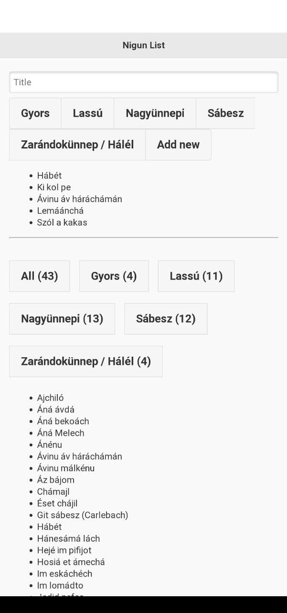

# nigunlist

A database of all the melodies I know

Keep track of all the melodies and their categories simply, online, on your phone and on your PC.

Add categories, titles, and match them to each other with a simple, intuitive interface.

That's how it looks on my phone:

In order to use this, it is recommended to self-host it. Currently there is a simple password protection built-in, which you can control in your own MySQL database.

